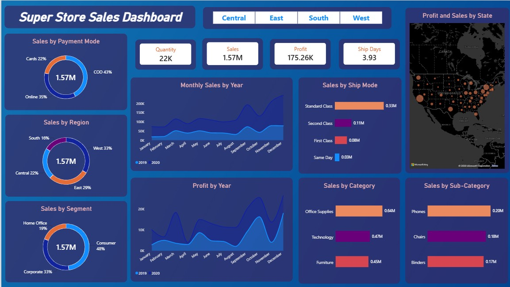

# 📊 Super Store Sales Dashboard  
### Future Interns – Data Science & Analytics  
### **Track Code:** DS  
### **Task Number:** 01  
### **Repository:** FUTURE_DS_01  

---

## 👨‍💻 Author
**Khaisar Tasneem Shaik**  
Future Interns – Data Science & Analytics  

---

## 📁 Project Overview
This project presents a **Business Sales Performance Dashboard** built using **Power BI**.  
It provides a comprehensive analysis of sales, profit, quantity, and shipping performance across multiple dimensions — including **region**, **segment**, **category**, and **payment mode**.  
The dashboard enables data-driven insights for business growth and operational efficiency.

## 🖼 Dashboard Preview


---

## 📂 Repository Structure

```
FUTURE_DS_01/
│
├── Task 1 - Business Sales Performance Analytics.pbix        # Power BI dashboard file
│
├── SuperStore_Sales_Dataset.csv                              # Raw data file used
│
├── Dashboard_Screenshot.jpg                                  # Dashboard visual
│
└── README.md                                                 # Documentation
```

---

## 📊 Dashboard Highlights

### **Key Metrics**
- **Total Sales:** 1.57M  
- **Total Profit:** 175.26K  
- **Total Quantity Sold:** 22K  
- **Average Ship Days:** 3.93  

---

### **Sales Breakdown**
- **By Payment Mode:**  
  - COD – 43%  
  - Online – 35%  
  - Cards – 22%  

- **By Region:**  
  - West – 33%  
  - East – 29%  
  - Central – 22%  
  - South – 16%  

- **By Segment:**  
  - Consumer – 48%  
  - Corporate – 33%  
  - Home Office – 19%  

---

### **Category & Sub‑Category Performance**
- **Category Sales:**  
  - Office Supplies – 0.64M  
  - Technology – 0.47M  
  - Furniture – 0.45M  

- **Top Sub‑Categories:**  
  - Phones – 0.20M  
  - Chairs – 0.18M  
  - Binders – 0.17M  

---

### **Trend Analysis**
- **Monthly Sales by Year:**  
  - Steady growth observed in 2020, peaking in October and December.  
- **Profit by Year:**  
  - Profit fluctuations with strong performance in Q4.  
- **Sales by Ship Mode:**  
  - Standard Class leads with 0.33M in sales.  

---

### **Geographical Insights**
The **Profit and Sales by State** map visualizes performance across U.S. states.  
Larger circles indicate higher sales and profitability, helping identify regional strengths.

---

## 💡 Key Insights & Recommendations

### **Insights**
- West region contributes the highest sales share (33%).  
- Consumer segment drives nearly half of total revenue.  
- COD is the most preferred payment mode.  
- Office Supplies and Technology categories yield strong profits.  
- Seasonal spikes in October and December indicate holiday-driven demand.

### **Recommendations**
- Focus marketing efforts on high-performing regions (West & East).  
- Expand product offerings in top-performing sub-categories (Phones, Chairs).  
- Encourage online payments to reduce COD dependency.  
- Optimize shipping processes to lower average ship days.

---

## 🛠 Tools & Technologies Used
- **Power BI** – Dashboard creation and visualization  
- **CSV** – Data preprocessing  
- **DAX** – Calculated measures and KPIs  
- **Data Modeling** – Relationships and hierarchies  

---

## 🔗 Dashboard Access
The dashboard has not been published to Power BI Service.  
You can explore the full interactive dashboard using the file included in this repository:

**Task 1 - Business Sales Performance Analytics.pbix**

---

## 📝 Submission Notes
- Repository name follows required format: **FUTURE_DS_01**  
- Includes: PBIX file, datasets, screenshots, README  
- Public repository for review and verification
